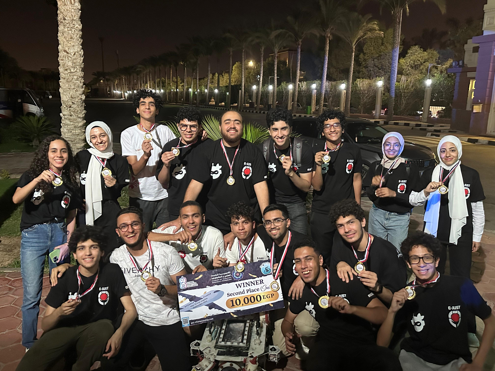

# GO Dive Derby 2024

## Introduction
Ejust Robotics Club proudly presents Shiro Kaijen, our latest Remotely Operated Vehicle (ROV) designed for the upcoming ROV competition. Ejust Robotics Club was established in 2020 to nurture students' passion for robotics, providing them with opportunities to showcase their talents, acquire new skills, and engage in both local and international robotics competitions. This repository is dedicated to highlighting the software tasks involved in the Go Dive Derby Competition, including the development of control systems, sensor integration, and autonomous navigation.

  

## Table of Contents
1. [About the Competition](#about-the-competition)
1. [Software Tasks](#software-tasks) 
1. [Team Members](#team-members)
1. [Demo](#demo)

## About the Competition
Small remote-controlled submarine competitions are exciting events that bring together enthusiasts of underwater robotics and engineering. Participants showcase their skills in designing and operating miniature submarines through challenges like obstacle courses, underwater mazes, and simulated missions. Submarines are constructed using lightweight materials and propulsion systems for controlled maneuverability, often equipped with cameras and sensors for real-time feedback. Tasks include agility tests, object retrieval, and navigation through obstacles, fostering creativity, problem-solving, and teamwork among participants. These events promote technical skills and inspire a passion for marine robotics and underwater exploration, emphasizing sustainability and marine ecosystem awareness.    
For detailed rules and guidelines, please refer to the [Competition Rule Book](https://drive.google.com/file/d/1jpSVa2LGZGNbB3ZjQbqmj3Nvcj06yKWg/view?usp=sharing).

## Software Tasks

### Task 1: Mapping the Tomb
In the context of the competition, the "tomb" refers to a simulated or modeled structure designed to replicate a historical or archaeological site. Participants are tasked with creating a map of this tomb, either through manual drawing or automated methods. The map creation process involves accurately plotting the positions of specific items within the tomb. Points are awarded based on the precision of item placement, with 5 points given for drawing the map and an additional 10 points for correctly positioning items. Teams opting for automated mapping methods receive an extra 10-point bonus. It's crucial that once items are placed on the map, their positions cannot be altered, emphasizing accuracy and careful planning in mapping the tomb structure.

Our work for this task can be found in the `mapping/` directory.

### Task 2: Green Squares Count
Teams will analyze a 1x1 meter banner divided into 100 squares, some green and some white. Counting the green squares accurately earns 5 points, and correctly calculating the percentage of green squares compared to the total area earns 10 points. While using image processing is allowed and may simplify this task, teams can also do this manually. Additionally, teams must estimate how the percentage of green squares has changed over a month, based on a provided photograph.

Our work for this task can be found in the `green-squares-count/` directory.

### Task 3: Dimensional Analysis
Teams will measure the dimensions of a coffin and a tomb door to determine if the door can pass the coffin. Getting both the height of the door and the length of the coffin correct within a 2 cm tolerance earns 25 points. If a team correctly measures only one dimension, they earn 10 points. 

Our work for this task can be found in the `measurement/` directory.

### Task 4: Symbol Detection
Teams must utilize a dataset to develop an AI model capable of accurately recognizing symbols displayed on a banner. Points will be awarded based on identifying all the symbols present on the banner.

Our work for this task can be found in the `symbols-detection/` directory.

### Task 5: Pipeline Inspection
Teams will navigate a simulated pipeline represented by three circles positioned 10 cm above the ground. Each circle has a diameter of 80 cm. Successfully navigating each circle without rotating the ROV earns 10 points per circle. If the ROV completes the entire path autonomously without needing intervention from a pilot, the team gets a bonus 10 points. Contact with the circles during navigation requires the ROV to restart that part of the task.

Our work for this task can be found in the `circles-navigation/` directory.

## Team Members
- **[Name]** - [Role]: [Contribution]
- **[Name]** - [Role]: [Contribution]
- **[Name]** - [Role]: [Contribution]

## Demo
