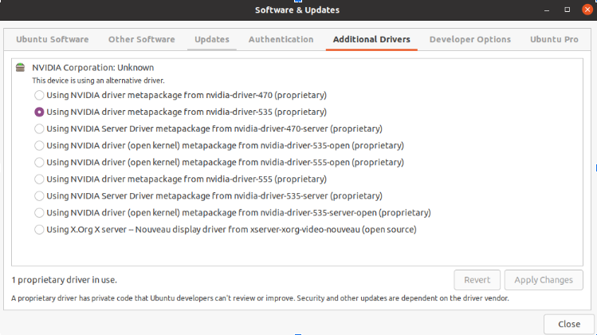
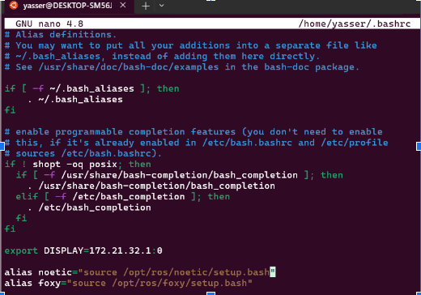
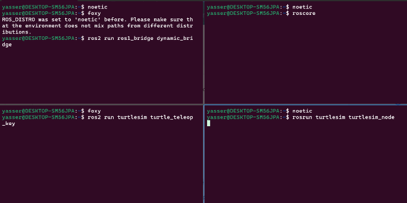

# ROV Workstation Setup

## Overview
This section provides guidelines for setting up the workstation environment necessary to run and control the ROV.

## Table of Contents
- [Gstreamer Setup](#gstreamer-setup)
- [GPU Setup](#gpu-setup)
- [ROS Installations](#ros-installations)
- [Run the ROV](#run-the-rov)

___

## Gstreamer Setup
Follow the steps in this [link](https://galaktyk.medium.com/how-to-build-opencv-with-gstreamer-b11668fa09c).

___

## GPU Setup
1. **Install Nvidia driver**: search for Additional Drivers in Ubuntu applications and choose:
<p align="center">
  
</p>

If the driver is not installed, you can install it manually. Follow this [link](https://www.nvidia.com/download/index.aspx).


2. **install cudnn**: Follow this [link](https://developer.nvidia.com/cudnn-downloads?target_os=Linux&target_arch=x86_64&Distribution=Ubuntu&target_version=22.04&target_type=deb_local).


3. **Install cuda toolkit**: Follow this [link](https://developer.nvidia.com/cuda-downloads?target_os=Linux&target_arch=x86_64&Distribution=Ubuntu&target_version=22.04&target_type=deb_local).

4. **Install anaconda**: Follow this [link](https://www.anaconda.com/download/).

5. Create a new environment named gpu.
    ```
    conda create -n gpu python=3.9
    ```

6. Activate this environment.
    ```
    conda activate gpu
    ```

7. Install pytorch gpu.
    ```
    conda install pytorch torchvision torchaudio pytorch-cuda=12.1 -c pytorch -c nvidia
    ```

8. Install ultralytics.
    ```
    pip install ultralytics
    ```

9. Install tensorflow gpu (optional).
    ```
    conda install -c anaconda tensorflow-gpu
    ```
    ```
    conda install -c conda-forge keras
    ```
10. Notebook support.
    ```
    conda install -c anaconda ipython
    ```
    ```
    conda install ipykernel
    ```
    ```
    conda install nb_conda_kernels
    ```
    ```
    pip install --upgrade nbconvert
    ```

11. Useful utils.
    ```
    pip3 install opencv-python
    ```
    ```
    conda install -c conda-forge matplotlib
    ```
    ```
    conda install -c anaconda pillow
    ```
    ```
    conda update pillow
    ```
    ```
    pip3 install numpy==1.23
    ```
    ```
    conda install -c anaconda scikit-learn
    ```
    ```
    conda install -c anaconda pandas
    ```

___

## ROS Installations


1. **ROS1 Noetic installation**: Follow this [link](https://wiki.ros.org/noetic/Installation/Ubuntu). A [Video](https://www.youtube.com/watch?v=ZA7u2XPmnlo&ab_channel=RoboticsBack-End)

2. **ROS2 Foxy installation**: Follow this [link](https://docs.ros.org/en/foxy/Installation/Ubuntu-Install-Debians.html). A [Video](https://www.youtube.com/watch?v=fxRWY0j3p_U&ab_channel=RoboticsBack-End)
   
3. Install ROS1 bridge.
    ```
    sudo apt install ros-foxy-ros1-bridge
    ```
4. Set the alias for noetic and foxy in the `.bashrc` file.
    ```
    nano ~/.bashrc
    ```
    At the end of the file, write:
    ```
    alias noetic="source /opt/ros/noetic/setup.bash"
    ```
    ```
    alias foxy="source /opt/ros/foxy/setup.bash"
    ```
<p align="center">
  
</p>


5. Testing the installation of ROS1 and ROS2.
   - Open a terminal and type these commands to run ROS1 roscore:
     ```
     noetic
     ```
     ```
     roscore
     ```
   - Open another terminal and type these commands to run ROS1 bridge:
     ```
     noetic
     ```
     ```
     foxy
     ```
     ```
     ros2 run ros1_bridge dynamic_bridge
     ```
   - On another terminal, run ROS1 turtlesim_node:
     ```
     noetic
     ```
     ```
     rosrun turtlesim turtlesim_node
     ```
   - On another terminal, run ROS2 turtle_teleop_key:
     ```
     foxy
     ```
     ```
     ros2 run turtlesim turtle_teleop_key
     ```
<p align="center">
  
</p>

<br> <br>

<p align="center">
  
</p>


6. Install tf-transformations.
    ```
    sudo apt install ros-foxy-tf-transformations
    ```
7. Install pygame on the Python interpreter accessible to ROS2.
    ```
    pip install pygame
    ```

___

## Run the ROV

1. Connect to ejust wifi network. Passward is 12345678.
  
2. Change your IP address to be static (manual), and set it to: 192.168.1.69

3. Reconnect to ejust.

4. Disable the firewall.
    ```
    sudo ufw disable
    ```


5. Add the following lines at the end of the `bashrc` file.
    ```
    nano ~/.bashrc
    ```
    At the end of the file, write:
    ```
    export ROS_MASTER_URL="http://192.168.1.69:11311"
    ```
    ```
    export ROS_IP="192.168.1.69"
    ```
    ```
    export ROS_DOMAIN_IP=5
    ```
6. Open a terminal and type these commands to run ROS1 roscore:
   ```
   noetic
   ```
   ```
   roscore
   ```
  
7. Open another terminal and type this command to run ROS1 bridge:
   ```
   ros2 run ros1_bridge dynamic_bridge
   ```

8. Open another terminal to access the main Raspberry via ssh, and then type the command that runs all the sensors and thrusters.
   ```
   ssh ubuntu@192.168.1.120
   ```
   The password is `turtlebot`. Inside the raspberry's terminal, type this command:
   ```
   launch_all
   ```

9. Open another terminal and navigate to the `colcon_ws` directory.


10. If you did not build the workspace before or you changed something inside the workspace, type the following command to build it.
   ```
   colcon build
   ```

11. Source the setup script.
   ```
   source install/setup.bash
   ```
12. Ensure the Joystick is connected to your device. Then, type the following command to control the ROV via the Joystick.
   ```
   ros2 launch rov_24 launch_file.launch.py
   ```
