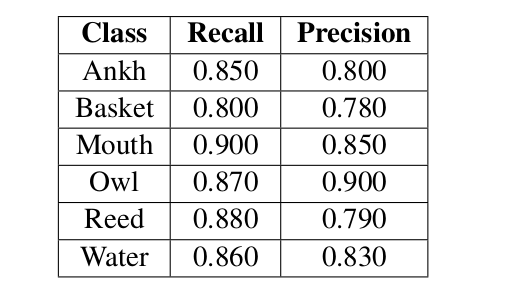

# Symbols Detection

## Overview
our team developed an AI model aimed at accurately identifying symbols displayed on a banner. This task is crucial for earning points based on the correct recognition of all symbols present.

## Approach
We utilized a YOLOv8-based computer vision model trained on a custom dataset containing six hieroglyphic symbols. The development process involved iterative rounds of image preprocessing and model fine-tuning to achieve satisfactory performance aligned with the competition's objectives.

## Dataset
- The dataset consists of images containing six hieroglyphic symbols. Each image in the dataset is annotated with bounding boxes that precisely delineate the location of each symbol.
- The images were collected from these sources:
     - [Source 1](https://github.com/morrisfranken/glyphreader)
     - [Source 2](https://www.metmuseum.org/about-the-met/collection-areas/egyptian-art)
     - [Source 3](https://www.flickr.com/photos/profzucker/)
     - [Source 4](https://stock.adobe.com/search?k=egypt+hieroglyphics)
- Roboflow was used for annotating the images and preparing them for training.
- There are six classes in the data set: Ankh, Basket, Mouth, Owl, Reed, and Water.
- Total Number of Images: 1599 images, Train Set: 70% (1120 images), Validation Set: 15% (239 images), Test Set: 15% (240 images).

## Data Preparation

Before training, we conducted extensive preprocessing on the dataset to enhance the model's performance:

- **Cropping**: Adjusting the size of images to focus on relevant parts containing symbols.
- **Rotation**: Correcting image orientation to standardize input for the model.
- **Grayscale Conversion**: Converting images to grayscale to reduce computation complexity and focus on symbol shape.
- **Adaptive Thresholding**: Applying adaptive thresholding techniques to binarize images based on local pixel intensities, enhancing symbol visibility.
- **Data Augmentation**: The following augmentation parameters were applied:
     - Rotation: Between −14◦ and +14◦
     - Blur: Up to 1.9 px
     - Outputs per training example: 3

## Results

The following table shows the values of the precision and recall of the validation set on each class.

  

In our hieroglyphic symbol detection task, precision and recall are crucial. The model must be accurate and
reliable to prevent mislabeling symbols, which could distort our interpretation of ancient inscriptions. Additionally, the model needs to recall all instances of the classes in an image to ensure a comprehensive understanding of the inscriptions.
   

From the table, we can see that our model successfully detected all instances of basket, owl, and reed symbols, with only slight losses in other classes. Regarding precision, the model accurately detected nearly all instances without any false positives for the classes of ankh, and basket, with minor losses in the mouth, owl, and reed classes. The slight reductions in precision and recall are acceptable given the competition’s conditions and the hardware limitations.
